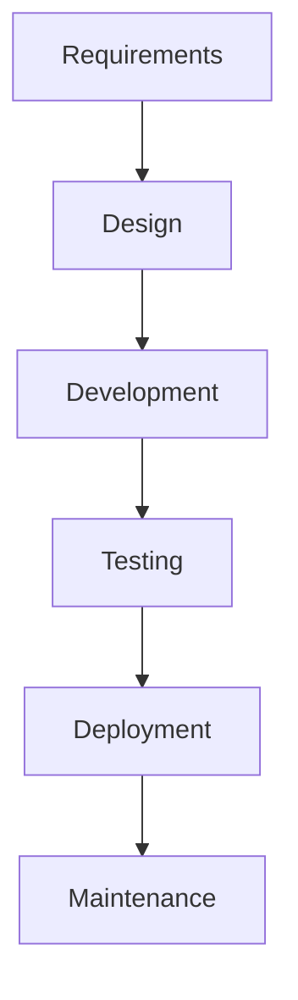

# Diagram to Image Conversion Implementation Plan
## Manual Testing Learning Platform - Visual Enhancement Project

---

## Executive Summary

This document outlines the comprehensive plan to convert all ASCII diagrams, tree structures, flowcharts, tables, and other visual elements in markdown content files into properly rendered images for enhanced UI presentation.

**Project Goal:** Replace code-block visual elements with actual images to improve learning experience and visual clarity.

**Estimated Timeline:** 2-3 weeks
**Estimated Effort:** 40-60 hours

---

## Table of Contents

1. [Phase 1: Discovery & Audit](#phase-1-discovery--audit)
2. [Phase 2: Infrastructure Setup](#phase-2-infrastructure-setup)
3. [Phase 3: Image Generation](#phase-3-image-generation)
4. [Phase 4: Content Migration](#phase-4-content-migration)
5. [Phase 5: UI Component Development](#phase-5-ui-component-development)
6. [Phase 6: Testing & Quality Assurance](#phase-6-testing--quality-assurance)
7. [Phase 7: Deployment & Documentation](#phase-7-deployment--documentation)
8. [Appendix: Technical Specifications](#appendix-technical-specifications)

---

## Phase 1: Discovery & Audit

**Duration:** 3-4 days
**Effort:** 8-10 hours

### 1.1 Objectives
- Identify all visual elements across all markdown files
- Categorize diagrams by type
- Create comprehensive inventory
- Estimate conversion complexity

### 1.2 Tasks

#### Task 1.1: Automated Scan
**Tool:** Custom Node.js script
**Input:** All `Week*.md` files
**Output:** `diagram_inventory.json`

```javascript
// Script to scan for visual elements
const fs = require('fs');
const path = require('path');

// Patterns to detect:
// - ASCII tree diagrams (├, └, │, ─)
// - Flowcharts (→, ←, ↑, ↓, ┌, ┐)
// - Tables (┌─┬─┐, ├─┼─┤)
// - Code blocks with visual content
```

**Deliverable:** Automated scanning script

#### Task 1.2: Manual Review
- Review each identified element
- Verify it's truly a visual diagram (not code)
- Categorize by type
- Assess conversion complexity (Simple/Medium/Complex)

**Deliverable:** Reviewed and categorized inventory

#### Task 1.3: Create Inventory Document
**Format:** Spreadsheet/JSON with columns:
- File Name
- Line Number Range
- Diagram Type
- Description
- Complexity
- Priority (High/Medium/Low)
- Conversion Method
- Status

**Example Entry:**
```json
{
  "id": "DIAG-001",
  "file": "Week1_Day1_Manual_Testing_Fundamentals_SDLC.md",
  "lineStart": 145,
  "lineEnd": 165,
  "type": "Tree Diagram",
  "description": "Test Design Techniques Hierarchy",
  "complexity": "Medium",
  "priority": "High",
  "conversionMethod": "SVG Generation",
  "status": "Pending",
  "estimatedTime": "30 minutes"
}
```

**Deliverable:** `DIAGRAM_INVENTORY.md` and `diagram_inventory.json`

### 1.3 Success Criteria
- ✅ All markdown files scanned
- ✅ 100% of visual elements identified
- ✅ Inventory document created
- ✅ Conversion approach defined for each diagram type

---

## Phase 2: Infrastructure Setup

**Duration:** 2-3 days
**Effort:** 6-8 hours

### 2.1 Objectives
- Set up folder structure for images
- Install required tools and libraries
- Create image generation templates
- Set up version control for images

### 2.2 Tasks

#### Task 2.1: Create Folder Structure
```
manual-testing-app/
├── public/
│   └── images/
│       └── diagrams/
│           ├── week1/
│           │   ├── day1/
│           │   ├── day2/
│           │   └── ...
│           ├── week2/
│           │   ├── day8/
│           │   └── ...
│           ├── week3/
│           │   ├── day15/
│           │   └── ...
│           └── common/
│               ├── icons/
│               └── templates/
└── scripts/
    └── diagram-generation/
        ├── generators/
        │   ├── tree-generator.js
        │   ├── flowchart-generator.js
        │   ├── table-generator.js
        │   └── custom-generator.js
        ├── templates/
        └── utils/
```

**Deliverable:** Folder structure created

#### Task 2.2: Install Tools & Dependencies
```bash
# Install diagram generation tools
npm install --save-dev mermaid-cli
npm install --save-dev puppeteer
npm install --save-dev canvas
npm install --save-dev svg.js
npm install --save-dev d3

# Install image optimization
npm install --save-dev sharp
npm install --save-dev imagemin
```

**Deliverable:** `package.json` updated with dependencies

#### Task 2.3: Create Generation Scripts
**Scripts to create:**
1. `tree-diagram-generator.js` - For hierarchical tree structures
2. `flowchart-generator.js` - For process flows using Mermaid
3. `table-to-image.js` - For complex tables
4. `custom-svg-generator.js` - For custom diagrams
5. `batch-processor.js` - To process multiple diagrams

**Deliverable:** Generation scripts in `scripts/diagram-generation/`

#### Task 2.4: Create Image Naming Convention
**Format:** `{week}_{day}_{type}_{sequence}.{ext}`

**Examples:**
- `w1_d1_tree_test-design-techniques.svg`
- `w1_d1_flow_sdlc-process.svg`
- `w2_d8_table_browser-compatibility.png`

**Deliverable:** Naming convention document

### 2.3 Success Criteria
- ✅ Folder structure created
- ✅ All tools installed and tested
- ✅ Generation scripts functional
- ✅ Naming convention established

---

## Phase 3: Image Generation

**Duration:** 5-7 days
**Effort:** 20-30 hours

### 3.1 Objectives
- Generate images for all identified diagrams
- Optimize images for web
- Ensure consistent styling
- Create fallback versions

### 3.2 Tasks by Diagram Type

#### Task 3.1: Tree Diagrams (Priority: High)
**Count:** ~50-70 diagrams
**Method:** SVG generation using D3.js or custom SVG

**Example Input (ASCII):**
```
Test Design Techniques
├── Black Box (Specification-based)
│   ├── Equivalence Partitioning
│   ├── Boundary Value Analysis
│   └── Decision Table
├── White Box (Structure-based)
│   ├── Statement Coverage
│   └── Branch Coverage
└── Experience-Based
    ├── Error Guessing
    └── Exploratory Testing
```

**Output:** SVG file with:
- Clean, professional styling
- Consistent colors (matching app theme)
- Proper spacing and alignment
- Responsive sizing

**Script Example:**
```javascript
// scripts/diagram-generation/generators/tree-generator.js
const { createSVGWindow } = require('svgdom');
const { SVG, registerWindow } = require('@svgdotjs/svg.js');

function generateTreeDiagram(data, outputPath) {
  const window = createSVGWindow();
  registerWindow(window, window.document);
  
  const canvas = SVG(window.document.documentElement);
  // Generate tree structure
  // Apply styling
  // Export to file
}
```

**Deliverable:** All tree diagrams converted to SVG

#### Task 3.2: Flowcharts (Priority: High)
**Count:** ~30-40 diagrams
**Method:** Mermaid.js

**Example Input (Mermaid syntax):**


**Script Example:**
```javascript
// scripts/diagram-generation/generators/flowchart-generator.js
const { run } = require('@mermaid-js/mermaid-cli');

async function generateFlowchart(mermaidCode, outputPath) {
  await run(
    mermaidCode,
    outputPath,
    {
      theme: 'default',
      backgroundColor: 'transparent',
      width: 800,
      height: 600
    }
  );
}
```

**Deliverable:** All flowcharts converted to SVG/PNG

#### Task 3.3: Tables (Priority: Medium)
**Count:** ~40-60 tables
**Method:** HTML Canvas to PNG

**Example Input:**
```
┌──────────────┬─────────────┬──────────┐
│ Browser      │ Version     │ Support  │
├──────────────┼─────────────┼──────────┤
│ Chrome       │ 90+         │ Full     │
│ Firefox      │ 88+         │ Full     │
│ Safari       │ 14+         │ Partial  │
└──────────────┴─────────────┴──────────┘
```

**Output:** PNG with:
- Clean table styling
- Proper borders and spacing
- Readable fonts
- Alternating row colors

**Deliverable:** All tables converted to PNG

#### Task 3.4: Custom Diagrams (Priority: Medium)
**Count:** ~20-30 diagrams
**Method:** Custom SVG generation

**Types:**
- Architecture diagrams
- State diagrams
- Timeline charts
- Comparison matrices

**Deliverable:** All custom diagrams converted

#### Task 3.5: Image Optimization
**Process:**
1. Generate high-quality images
2. Optimize for web (compress, resize)
3. Create responsive versions (small, medium, large)
4. Generate WebP versions for modern browsers

**Script:**
```javascript
// scripts/diagram-generation/optimize-images.js
const sharp = require('sharp');

async function optimizeImage(inputPath, outputPath) {
  await sharp(inputPath)
    .resize(1200, null, { withoutEnlargement: true })
    .webp({ quality: 85 })
    .toFile(outputPath);
}
```

**Deliverable:** Optimized images in multiple formats

### 3.3 Quality Standards
- **Resolution:** Minimum 1200px width for complex diagrams
- **Format:** SVG preferred, PNG for raster content
- **File Size:** <100KB per image (optimized)
- **Accessibility:** All images must have descriptive alt text
- **Consistency:** Uniform color scheme matching app theme

### 3.4 Success Criteria
- ✅ All diagrams converted to images
- ✅ Images optimized for web
- ✅ Consistent styling applied
- ✅ Quality standards met

---

## Phase 4: Content Migration

**Duration:** 3-4 days
**Effort:** 10-12 hours

### 4.1 Objectives
- Update all markdown files with image references
- Remove ASCII diagram code blocks
- Add proper alt text and captions
- Maintain content integrity

### 4.2 Tasks

#### Task 4.1: Create Migration Script
**Script:** `scripts/migrate-diagrams.js`

**Functionality:**
1. Read markdown file
2. Identify diagram code blocks (from inventory)
3. Replace with image markdown syntax
4. Add alt text and caption
5. Preserve surrounding content
6. Create backup of original file

**Example Replacement:**
```markdown
<!-- BEFORE -->
```
Test Design Techniques
├── Black Box
│   ├── Equivalence Partitioning
│   └── Boundary Value Analysis
└── White Box
    ├── Statement Coverage
    └── Branch Coverage
```

<!-- AFTER -->


*Figure 1.1: Test Design Techniques categorized by approach*
```

**Deliverable:** Migration script

#### Task 4.2: Batch Process All Files
**Process:**
1. Create backup of all markdown files
2. Run migration script on each file
3. Verify replacements
4. Manual review of complex cases

**Deliverable:** Updated markdown files

#### Task 4.3: Add Image Metadata
**Create:** `images/diagrams/metadata.json`

**Content:**
```json
{
  "w1_d1_tree_test-design-techniques.svg": {
    "title": "Test Design Techniques Hierarchy",
    "description": "Categorization of test design techniques into Black Box, White Box, and Experience-Based approaches",
    "altText": "Tree diagram showing test design techniques hierarchy with three main branches",
    "source": "Week1_Day1_Manual_Testing_Fundamentals_SDLC.md",
    "lineNumber": 145,
    "createdDate": "2026-01-05",
    "dimensions": { "width": 800, "height": 600 },
    "fileSize": "45KB"
  }
}
```

**Deliverable:** Image metadata file

#### Task 4.4: Update Image References
**Ensure:**
- Correct relative paths
- Proper alt text for accessibility
- Captions where appropriate
- Responsive image syntax

**Example:**
```markdown


*Figure 1.1: Test Design Techniques categorized by approach*
```

**Deliverable:** All image references updated

### 4.3 Success Criteria
- ✅ All markdown files updated
- ✅ Image references correct
- ✅ Alt text added for accessibility
- ✅ Original files backed up
- ✅ No broken links

---

## Phase 5: UI Component Development

**Duration:** 3-4 days
**Effort:** 10-12 hours

### 5.1 Objectives
- Create React components for image rendering
- Add zoom/pan functionality
- Implement lightbox for detailed view
- Ensure responsive design
- Add accessibility features

### 5.2 Tasks

#### Task 5.1: Create DiagramImage Component
**File:** `manual-testing-app/src/components/DiagramImage.jsx`

**Features:**
- Lazy loading
- Click to zoom
- Responsive sizing
- Error handling (fallback)
- Accessibility (ARIA labels)

**Component Structure:**
```jsx
import React, { useState } from 'react';
import './DiagramImage.css';

const DiagramImage = ({ 
  src, 
  alt, 
  caption, 
  zoomable = true,
  maxWidth = '100%' 
}) => {
  const [isZoomed, setIsZoomed] = useState(false);
  const [imageError, setImageError] = useState(false);

  const handleClick = () => {
    if (zoomable) setIsZoomed(true);
  };

  const handleError = () => {
    setImageError(true);
  };

  if (imageError) {
    return (
      <div className="diagram-error">
        <p>Image failed to load: {alt}</p>
      </div>
    );
  }

  return (
    <figure className="diagram-container">
      
      {caption && <figcaption>{caption}</figcaption>}
      
      {isZoomed && (
        <DiagramLightbox
          src={src}
          alt={alt}
          onClose={() => setIsZoomed(false)}
        />
      )}
    </figure>
  );
};

export default DiagramImage;
```

**Deliverable:** DiagramImage component

#### Task 5.2: Create DiagramLightbox Component
**File:** `manual-testing-app/src/components/DiagramLightbox.jsx`

**Features:**
- Full-screen view
- Zoom in/out controls
- Pan functionality
- Close on ESC key
- Overlay background

**Deliverable:** DiagramLightbox component

#### Task 5.3: Create DiagramGallery Component
**File:** `manual-testing-app/src/components/DiagramGallery.jsx`

**Use Case:** For pages with multiple related diagrams

**Features:**
- Grid layout
- Thumbnail view
- Click to expand
- Navigation between diagrams

**Deliverable:** DiagramGallery component

#### Task 5.4: Update Markdown Renderer
**File:** `manual-testing-app/src/components/MarkdownRenderer.jsx`

**Enhancement:** Custom image rendering

```jsx
import ReactMarkdown from 'react-markdown';
import DiagramImage from './DiagramImage';

const MarkdownRenderer = ({ content }) => {
  return (
    <ReactMarkdown
      components={{
        img: ({ node, ...props }) => {
          // Check if image is a diagram
          const isDiagram = props.src?.includes('/diagrams/');
          
          if (isDiagram) {
            return (
              <DiagramImage
                src={props.src}
                alt={props.alt}
                caption={props.title}
                zoomable={true}
              />
            );
          }
          
          return ;
        }
      }}
    >
      {content}
    </ReactMarkdown>
  );
};
```

**Deliverable:** Enhanced markdown renderer

#### Task 5.5: Add Responsive Styles
**File:** `manual-testing-app/src/components/DiagramImage.css`

**Responsive Breakpoints:**
```css
/* Mobile */
@media (max-width: 768px) {
  .diagram-container img {
    max-width: 100%;
    height: auto;
  }
}

/* Tablet */
@media (min-width: 769px) and (max-width: 1024px) {
  .diagram-container img {
    max-width: 90%;
  }
}

/* Desktop */
@media (min-width: 1025px) {
  .diagram-container img {
    max-width: 80%;
  }
}
```

**Deliverable:** Responsive CSS

### 5.3 Accessibility Features
- ✅ Alt text for all images
- ✅ ARIA labels
- ✅ Keyboard navigation (Tab, Enter, ESC)
- ✅ Screen reader support
- ✅ High contrast mode support
- ✅ Focus indicators

### 5.4 Success Criteria
- ✅ All components created and tested
- ✅ Zoom/pan functionality working
- ✅ Responsive on all devices
- ✅ Accessibility standards met
- ✅ Performance optimized (lazy loading)

---

## Phase 6: Testing & Quality Assurance

**Duration:** 2-3 days
**Effort:** 8-10 hours

### 6.1 Objectives
- Test all images render correctly
- Verify responsive behavior
- Test accessibility
- Performance testing
- Cross-browser compatibility

### 6.2 Tasks

#### Task 6.1: Visual Regression Testing
**Tool:** Percy or Chromatic

**Test Cases:**
- All diagrams render correctly
- No broken images
- Proper sizing and alignment
- Captions display correctly

**Deliverable:** Visual regression test suite

#### Task 6.2: Responsive Testing
**Devices to Test:**
- Mobile (320px, 375px, 414px)
- Tablet (768px, 1024px)
- Desktop (1280px, 1920px)

**Test Cases:**
- Images scale properly
- No horizontal scroll
- Readable on all sizes
- Touch interactions work (mobile)

**Deliverable:** Responsive test report

#### Task 6.3: Accessibility Testing
**Tools:** 
- axe DevTools
- WAVE
- Screen reader (NVDA/JAWS)

**Test Cases:**
- All images have alt text
- Keyboard navigation works
- Screen reader announces correctly
- Focus indicators visible
- Color contrast sufficient

**Deliverable:** Accessibility audit report

#### Task 6.4: Performance Testing
**Metrics:**
- Page load time
- Image load time
- Lazy loading effectiveness
- Memory usage

**Tools:**
- Lighthouse
- WebPageTest
- Chrome DevTools

**Targets:**
- Page load: <3 seconds
- Image load: <1 second
- Lighthouse score: >90

**Deliverable:** Performance test report

#### Task 6.5: Cross-Browser Testing
**Browsers:**
- Chrome (latest 2 versions)
- Firefox (latest 2 versions)
- Safari (latest 2 versions)
- Edge (latest 2 versions)

**Test Cases:**
- Images render correctly
- Zoom/pan works
- Lightbox functions
- No console errors

**Deliverable:** Browser compatibility report

### 6.3 Bug Tracking
**Create:** `DIAGRAM_BUGS.md`

**Track:**
- Bug ID
- Description
- Severity
- Browser/Device
- Status
- Fix

### 6.4 Success Criteria
- ✅ All tests passed
- ✅ No critical bugs
- ✅ Performance targets met
- ✅ Accessibility compliant
- ✅ Cross-browser compatible

---

## Phase 7: Deployment & Documentation

**Duration:** 1-2 days
**Effort:** 4-6 hours

### 7.1 Objectives
- Deploy updated content
- Create documentation
- Train team (if applicable)
- Monitor post-deployment

### 7.2 Tasks

#### Task 7.1: Pre-Deployment Checklist
- [ ] All images generated and optimized
- [ ] All markdown files updated
- [ ] Components tested
- [ ] Performance verified
- [ ] Accessibility verified
- [ ] Cross-browser tested
- [ ] Backup created

**Deliverable:** Deployment checklist

#### Task 7.2: Deployment
**Steps:**
1. Create deployment branch
2. Merge all changes
3. Run final tests
4. Deploy to staging
5. Smoke test on staging
6. Deploy to production
7. Monitor for issues

**Deliverable:** Deployed application

#### Task 7.3: Create Documentation

**Document 1: Developer Guide**
**File:** `DIAGRAM_DEVELOPER_GUIDE.md`

**Contents:**
- How to add new diagrams
- Image generation process
- Component usage
- Troubleshooting

**Document 2: Content Creator Guide**
**File:** `DIAGRAM_CONTENT_GUIDE.md`

**Contents:**
- When to use images vs code blocks
- How to reference diagrams
- Alt text best practices
- Caption guidelines

**Document 3: Maintenance Guide**
**File:** `DIAGRAM_MAINTENANCE_GUIDE.md`

**Contents:**
- How to update existing diagrams
- Image optimization process
- Performance monitoring
- Backup procedures

**Deliverable:** Complete documentation set

#### Task 7.4: Update Project README
**Add Section:** "Visual Diagrams"

**Content:**
- Overview of diagram system
- Folder structure
- How to use components
- Link to detailed guides

**Deliverable:** Updated README.md

#### Task 7.5: Post-Deployment Monitoring
**Monitor for 1 week:**
- Error logs
- Performance metrics
- User feedback
- Image load failures

**Tools:**
- Google Analytics
- Sentry (error tracking)
- Lighthouse CI

**Deliverable:** Monitoring report

### 7.3 Success Criteria
- ✅ Successfully deployed
- ✅ Documentation complete
- ✅ No critical issues
- ✅ Performance maintained
- ✅ Team trained

---

## Appendix: Technical Specifications

### A. Image Specifications

#### SVG Images
- **Format:** SVG 1.1
- **Viewbox:** Defined for responsiveness
- **Colors:** Match app theme
- **Fonts:** Web-safe or embedded
- **File Size:** <50KB (optimized)

#### PNG Images
- **Resolution:** 2x for retina displays
- **Color Depth:** 24-bit
- **Compression:** PNG-8 where possible
- **File Size:** <100KB (optimized)

#### WebP Images
- **Quality:** 85%
- **Fallback:** PNG for older browsers
- **File Size:** 30-50% smaller than PNG

### B. Naming Conventions

**Pattern:** `{week}_{day}_{type}_{description}.{ext}`

**Week:** w1, w2, w3
**Day:** d1-d21
**Type:** 
- tree (tree diagrams)
- flow (flowcharts)
- table (tables)
- arch (architecture)
- state (state diagrams)
- custom (custom diagrams)

**Description:** kebab-case, descriptive
**Extension:** svg, png, webp

**Examples:**
- `w1_d1_tree_test-design-techniques.svg`
- `w2_d8_flow_web-testing-process.svg`
- `w3_d15_table_agile-ceremonies.png`

### C. Folder Structure

```
manual-testing-app/
├── public/
│   └── images/
│       └── diagrams/
│           ├── week1/
│           │   ├── day1/
│           │   │   ├── w1_d1_tree_test-design-techniques.svg
│           │   │   ├── w1_d1_flow_sdlc-process.svg
│           │   │   └── metadata.json
│           │   ├── day2/
│           │   └── ...
│           ├── week2/
│           ├── week3/
│           └── metadata.json (global)
├── scripts/
│   └── diagram-generation/
│       ├── generators/
│       │   ├── tree-generator.js
│       │   ├── flowchart-generator.js
│       │   ├── table-generator.js
│       │   └── custom-generator.js
│       ├── templates/
│       │   ├── tree-template.svg
│       │   ├── flow-template.mmd
│       │   └── table-template.html
│       ├── utils/
│       │   ├── svg-optimizer.js
│       │   ├── image-compressor.js
│       │   └── metadata-generator.js
│       ├── migrate-diagrams.js
│       ├── batch-process.js
│       └── config.js
└── src/
    └── components/
        ├── DiagramImage.jsx
        ├── DiagramImage.css
        ├── DiagramLightbox.jsx
        ├── DiagramLightbox.css
        ├── DiagramGallery.jsx
        └── DiagramGallery.css
```

### D. Component API

#### DiagramImage Component
```jsx
<DiagramImage
  src="/images/diagrams/week1/day1/w1_d1_tree_test-design-techniques.svg"
  alt="Test Design Techniques Hierarchy"
  caption="Figure 1.1: Test Design Techniques categorized by approach"
  zoomable={true}
  maxWidth="800px"
  loading="lazy"
/>
```

**Props:**
- `src` (string, required): Image path
- `alt` (string, required): Alt text for accessibility
- `caption` (string, optional): Figure caption
- `zoomable` (boolean, optional, default: true): Enable zoom on click
- `maxWidth` (string, optional, default: '100%'): Maximum width
- `loading` (string, optional, default: 'lazy'): Loading strategy

#### DiagramLightbox Component
```jsx
<DiagramLightbox
  src="/images/diagrams/week1/day1/w1_d1_tree_test-design-techniques.svg"
  alt="Test Design Techniques Hierarchy"
  onClose={() => setIsOpen(false)}
  initialZoom={1.0}
/>
```

**Props:**
- `src` (string, required): Image path
- `alt` (string, required): Alt text
- `onClose` (function, required): Close handler
- `initialZoom` (number, optional, default: 1.0): Initial zoom level

#### DiagramGallery Component
```jsx
<DiagramGallery
  images={[
    { src: '...', alt: '...', caption: '...' },
    { src: '...', alt: '...', caption: '...' }
  ]}
  columns={3}
  gap="20px"
/>
```

**Props:**
- `images` (array, required): Array of image objects
- `columns` (number, optional, default: 3): Grid columns
- `gap` (string, optional, default: '20px'): Gap between images

### E. Performance Targets

**Page Load:**
- First Contentful Paint: <1.5s
- Largest Contentful Paint: <2.5s
- Time to Interactive: <3.5s

**Image Load:**
- Above-the-fold images: <1s
- Below-the-fold images: Lazy loaded
- Total image weight per page: <500KB

**Lighthouse Scores:**
- Performance: >90
- Accessibility: 100
- Best Practices: >90
- SEO: >90

### F. Accessibility Requirements

**WCAG 2.1 Level AA Compliance:**
- ✅ All images have descriptive alt text
- ✅ Color contrast ratio ≥4.5:1
- ✅ Keyboard navigation support
- ✅ Screen reader compatible
- ✅ Focus indicators visible
- ✅ No flashing content
- ✅ Resizable text (up to 200%)

### G. Browser Support

**Minimum Versions:**
- Chrome: 90+
- Firefox: 88+
- Safari: 14+
- Edge: 90+
- Mobile Safari: 14+
- Chrome Mobile: 90+

**Fallbacks:**
- WebP → PNG for older browsers
- SVG → PNG for IE11 (if needed)
- Modern CSS → Graceful degradation

---

## Timeline Summary

| Phase | Duration | Effort | Dependencies |
|-------|----------|--------|--------------|
| 1. Discovery & Audit | 3-4 days | 8-10 hours | None |
| 2. Infrastructure Setup | 2-3 days | 6-8 hours | Phase 1 |
| 3. Image Generation | 5-7 days | 20-30 hours | Phase 2 |
| 4. Content Migration | 3-4 days | 10-12 hours | Phase 3 |
| 5. UI Component Development | 3-4 days | 10-12 hours | Phase 4 |
| 6. Testing & QA | 2-3 days | 8-10 hours | Phase 5 |
| 7. Deployment & Documentation | 1-2 days | 4-6 hours | Phase 6 |
| **TOTAL** | **19-27 days** | **66-88 hours** | |

**Recommended Approach:** 2-3 weeks with dedicated focus

---

## Risk Assessment

### High Risk
1. **Large number of diagrams** - May take longer than estimated
   - **Mitigation:** Prioritize by importance, batch process
   
2. **Complex diagram conversion** - Some diagrams may be difficult to convert
   - **Mitigation:** Manual creation for complex cases, use professional tools

### Medium Risk
1. **Performance impact** - Many images may slow page load
   - **Mitigation:** Aggressive optimization, lazy loading, CDN
   
2. **Maintenance burden** - Updating diagrams requires regeneration
   - **Mitigation:** Automated scripts, clear documentation

### Low Risk
1. **Browser compatibility** - Older browsers may not support features
   - **Mitigation:** Fallbacks, progressive enhancement

---

##